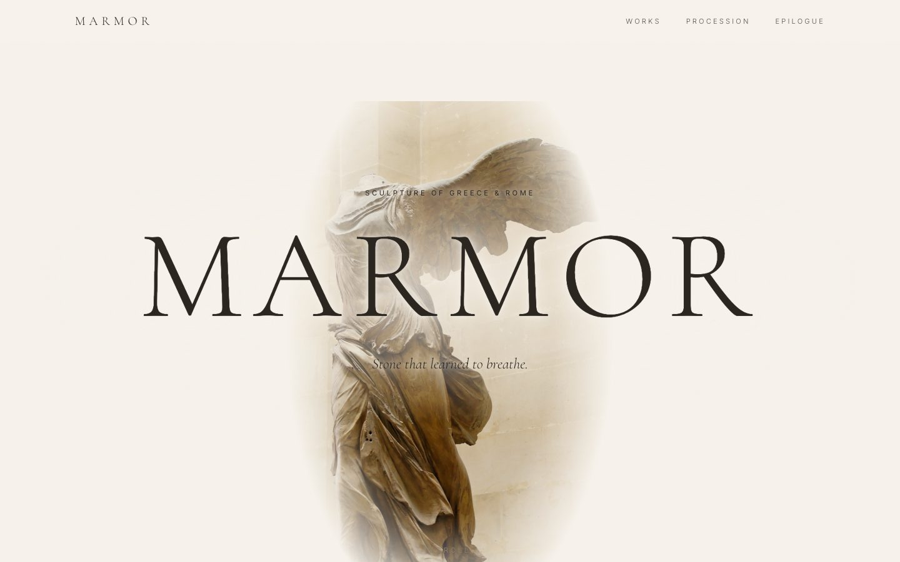
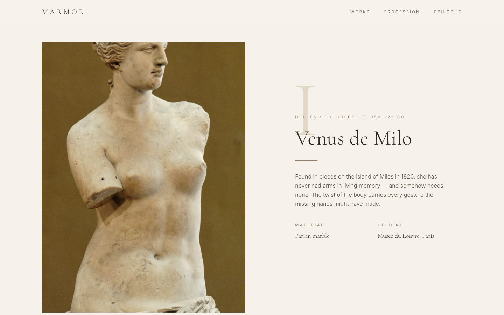
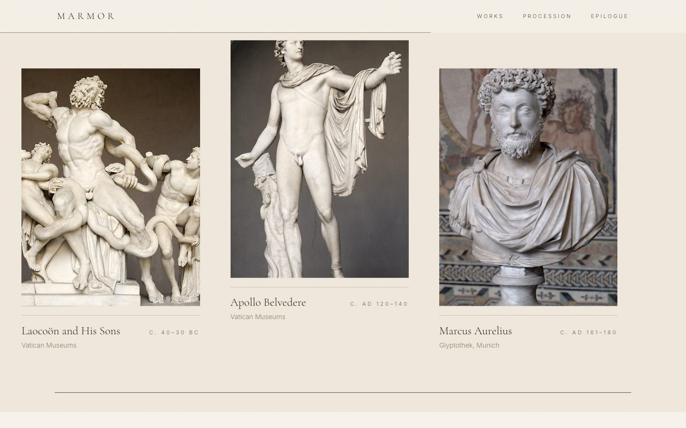
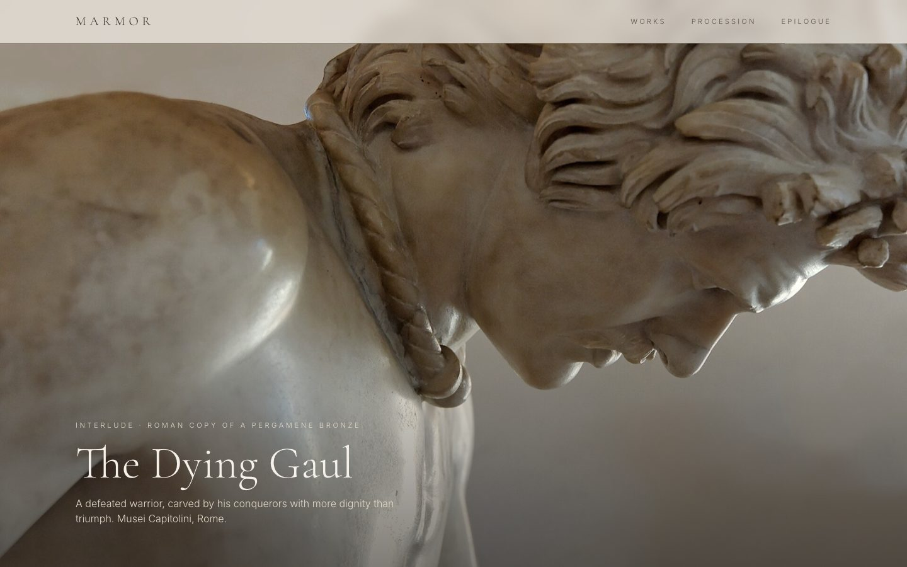
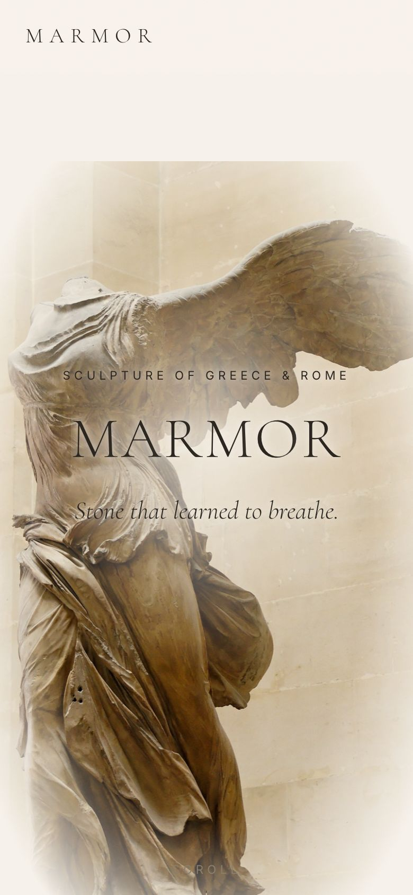
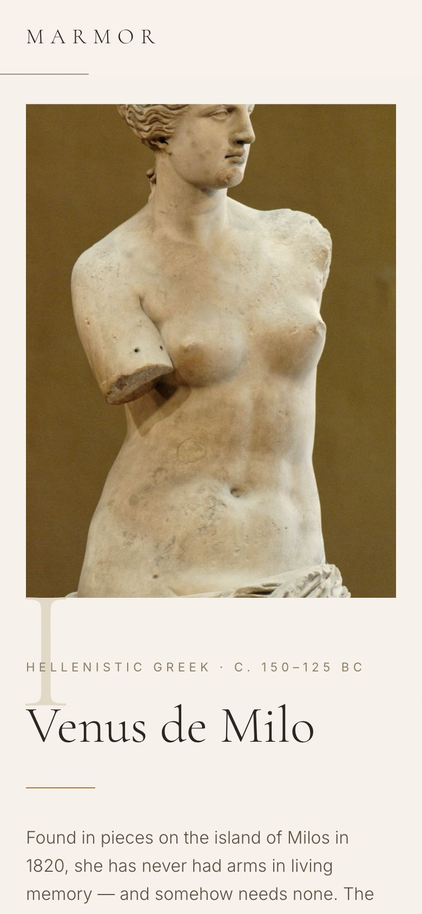

<div align="center">

# M A R M O R

*Stone that learned to breathe.*

A quiet, scroll-animated gallery of ancient Greek and Roman sculpture.

**[classical.ross-dev.workers.dev →](https://classical.ross-dev.workers.dev/)**


<br />



</div>

---

## The walk-through

The page reads top to bottom like a short visit to a museum. Each section has its own scroll animation.

| | |
|---|---|
| **I. Hero** | The Winged Victory of Samothrace sharpens into view while the title rises letter by letter. As you scroll, the statue drifts and the title fades away. |
| **II. Prologue** | A short passage whose words light up one at a time as you read down. |
| **III. Works** | Venus de Milo and Augustus of Prima Porta. Each photo is wiped open from below and drifts slightly while the text slides up beside it. |
| **IV. Procession** | The section pins in place and vertical scrolling pans sideways past Laocoön, the Apollo Belvedere and Marcus Aurelius. |
| **V. Interlude** | The Dying Gaul opens from a small framed window to fill the screen. |
| **VI. Epilogue** | *Ars longa, vita brevis*, then image credits. |







### On mobile

<p align="center">
  
  &nbsp;&nbsp;
  
</p>

---

## Design

- **Palette:** warm limestone and parchment tones (`#f7f3ec`, `#efe8dc`, `#2c2620`) with a single ochre accent, plus a faint marble grain over the whole page.
- **Type:** *Cormorant Garamond* for headings and *Inter* for body text.
- **Motion:** every animation is tied to scroll position or entry into view. A visitor's `prefers-reduced-motion` setting is respected.

## Getting started

```bash
npm install
npm run dev       # start the dev server
npm run build     # build a static site into dist/
npm run preview   # serve the production build locally
npm run lint      # lint with oxlint
```

## Project structure

```
src/
├── App.jsx                 # page composition
├── index.css               # Tailwind theme tokens, grain overlay
├── data/statues.js         # statue text, image paths, credits
└── components/
    ├── Nav.jsx             # fixed header and scroll progress line
    ├── Hero.jsx
    ├── Prologue.jsx        # word-by-word reveal
    ├── Feature.jsx         # image wipe and parallax rows
    ├── Procession.jsx      # pinned horizontal scroll
    ├── Interlude.jsx       # full-bleed expanding image
    └── Epilogue.jsx        # closing quote and footer
public/images/              # statue photographs
```

To add or change a statue, edit `src/data/statues.js` and put the image in `public/images/`.

## Image credits

All photographs are in the **public domain** and come from Wikimedia Commons:

- [Winged Victory of Samothrace](https://commons.wikimedia.org/wiki/File:Nike_of_Samothrake_Louvre_Ma2369_n4.jpg), Louvre
- [Venus de Milo](https://commons.wikimedia.org/wiki/File:Venus_de_Milo_Louvre_Ma399_n4.jpg), Louvre
- [Augustus of Prima Porta](https://commons.wikimedia.org/wiki/File:Statue-Augustus.jpg), Vatican Museums
- [Laocoön and His Sons](https://commons.wikimedia.org/wiki/File:Laocoon_Pio-Clementino_Inv1059-1064-1067.jpg), Vatican Museums
- [Apollo Belvedere](https://commons.wikimedia.org/wiki/File:Belvedere_Apollo_Pio-Clementino_Inv1015.jpg), Vatican Museums
- [Marcus Aurelius](https://commons.wikimedia.org/wiki/File:Marcus_Aurelius_Glyptothek_Munich.jpg), Glyptothek Munich
- [The Dying Gaul](https://commons.wikimedia.org/wiki/File:Dying_Gaul_Musei_Capitolini_MC747.jpg), Musei Capitolini
